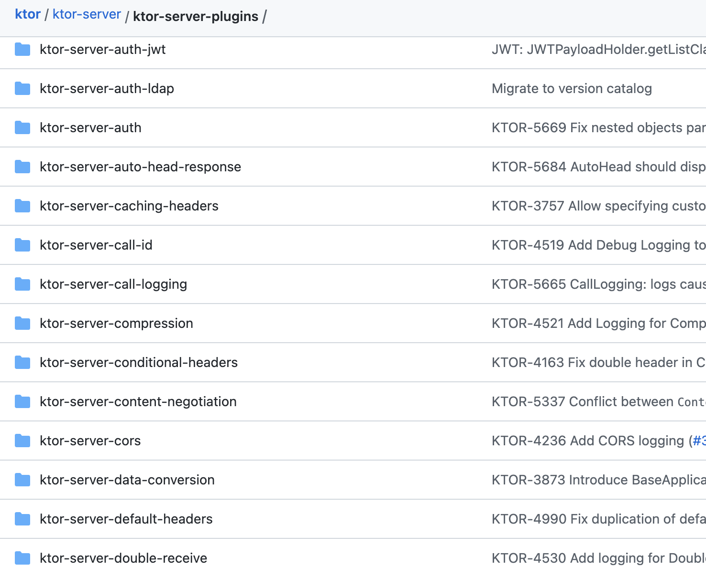

# Recipes

Some helpful recipes to help you best use the plugin.

## Adding Ktor features

When running the `@nxrocks/nx-ktor:project` generator from a non-interactive mode (like from `Nx Console`), we cannot automatically fetch and present to you, the list
of `Ktor` features (as we do in interactive, CLI mode). This is due to a limitation in Nx API, which does not support (yet?), such asynchronous prompts.

You will need to fetch and enter the features ids manually:

1. Go to [https://github.com/ktorio/ktor/tree/main/ktor-server/ktor-server-plugins](https://github.com/ktorio/ktor/tree/main/ktor-server/ktor-server-pluginss)
2. Look for the folders that start with `"ktor-server-"` prefix

> * everything __after__ the `ktor-server-` prefix, is the "id" of a Ktor feature

3. In Nx Console UI, enter the features ids you want to use, separated by a comma

