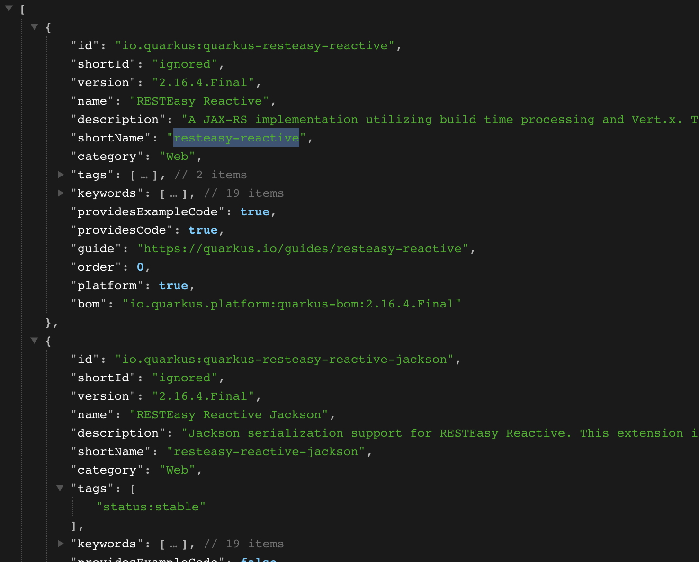
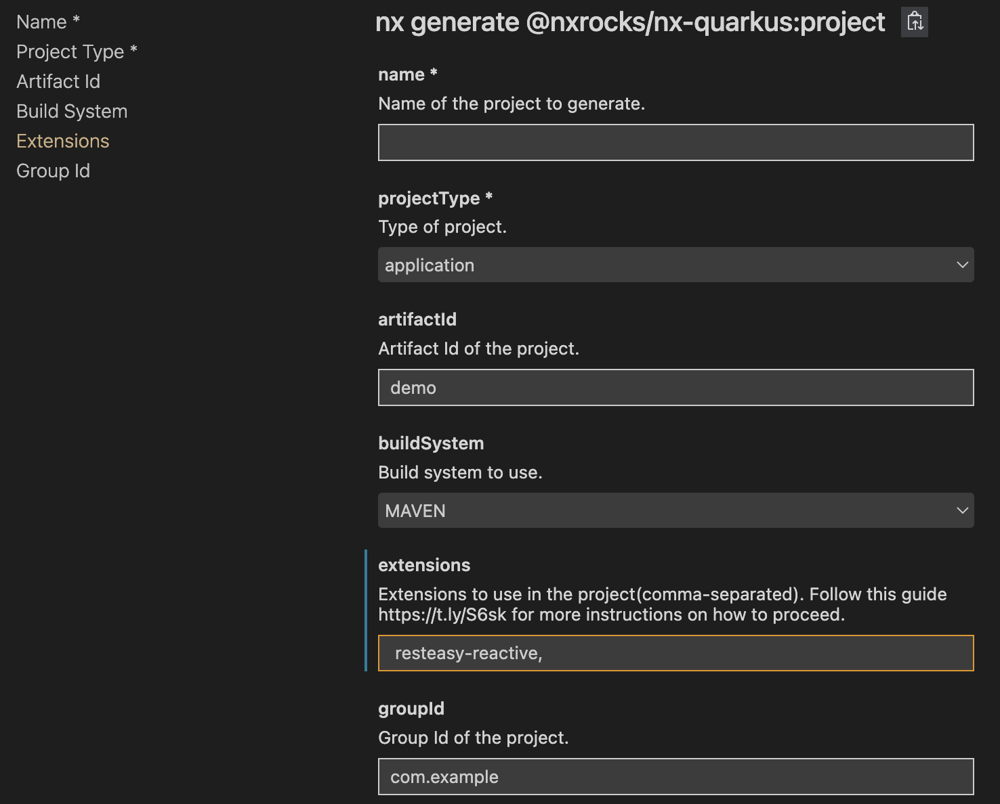

# Recipes

Some helpful recipes to help you best use the plugin.

## Adding Quarkus extensions

When running the `@nxrocks/nx-quarkus:project` generator from a non-interactive mode (like from `Nx Console`), we cannot automatically fetch and present to you, the list
of `Quarkus` extensions (as we do in interactive, CLI mode). This is due to a limitation in Nx API, which does not support (yet?), such asynchronous prompts.

You will need to fetch and enter the extensions ids manually:

1. Go to [https://code.quarkus.io/api/extensions](https://code.quarkus.io/api/extensions)

> * Each `id` or `shortName`(when not empty) is the "id" of a Quarkus extension
> * For example, `resteasy-reactive` for `io.quarkus:quarkus-resteasy-reactive`, `io.quarkus:quarkus-rest-client-reactive-jsonb` for `io.quarkus:quarkus-rest-client-reactive-jsonb`, etc.

2. In Nx Console UI, enter the extensions ids you want to use, separated by a comma

## Creating multi-modules Quarkus projects

The support for creating multi-module Quarkus project with either `Maven` or `Gradle` was added to the plugin since `v6.1.0`.

When generating a new project, you can now choose either to:

* Transform the project being generated into a multi-module project by setting `transformIntoMultiModule` to `true` and by providing the name of the parent module to create on top of the child project, via `parentModuleName` option.
* Add the project being generated into an existing multi-module project by setting `addToExistingParentModule` to `true` and by providing the name of the parent module to add the child project too.

> **Note** When running the `@nxrocks/nx-quarkus:project` generator in **interactive mode** (i.e via command line),
> we can automatically analyze your workspace and prompt for the appropriate above options to add multi-module support.
