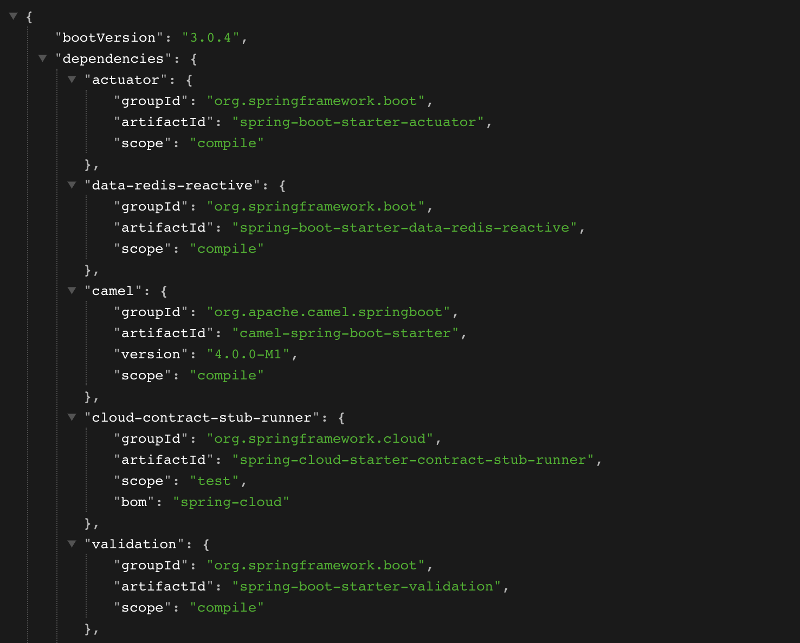
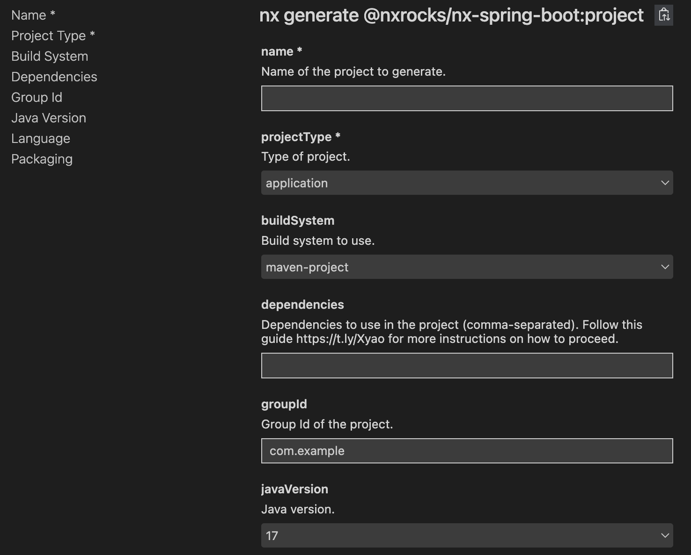

# Recipes

Some helpful recipes to help you best use the plugin.

## Adding Spring Boot dependencies

When running the `@nxrocks/nx-spring-boot:project` generator from a non-interactive mode (like from `Nx Console`), we cannot automatically fetch and present to you, the list
of `Spring Boot` dependencies (as we do in interactive, CLI mode). This is due to a limitation in Nx API, which does not support (yet?), such asynchronous prompts.

You will need to fetch and enter the dependencies ids manually:

1. Go to [https://start.spring.io/dependencies](https://start.spring.io/dependencies)
2. Look for the `"dependencies"` section of the  output JSON

> * Each `key` in this section, is the "id" of a Spring Boot dependency
> * For example, `web` for `spring-boot-starter-web`, `actuator` for `spring-boot-starter-actuator`, etc.

3. In Nx Console UI, enter the dependencies ids you want to use, separated by a comma

## Creating mulit-modules Spring Boot projects

The support for creating multi-module Spring Boot project with either `Maven` or `Gradle` was added to the plugin since `v8.1.0`.

When generating a new project, you can now choose either to:

* Transform the project being generated into a multi-module project by setting `transformIntoMultiModule` to `true` and by providing the name of the parent module to create on top of the child project, via `parentModuleName` option.
* Add the project being generated into an existing multi-module project by setting `addToExistingParentModule` to `true` and by providing the name of the parent module to add the child project too.

> **Note** When running the `@nxrocks/nx-spring-boot:project` generator in **interactive mode** (i.e via command line),
> we can automatically analyze your workspace and prompt for the appropriate above options to add multi-module support.
